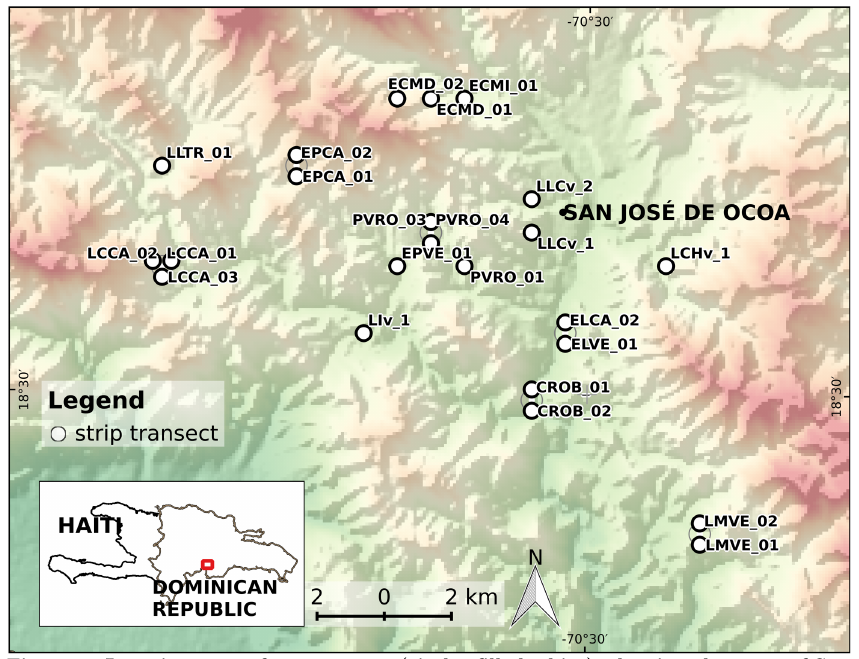

# Historia de un rechazo: ordenación de comunidades plantas de Ocoa, revisitada

*XVIII Jornada de Investigación Científica*

*12, 13 y 14 de noviembre, 2019*

**Sometimiento de resumen**

| | |
|:--|:-----------|
| **Título:** | Historia de un rechazo: ordenación de comunidades plantas de Ocoa, revisitada |
| **Tipo de participación:** | Oral |
| **Nombre de autores:** | José Ramón Martínez Batlle |
| **Institución/Facultad:** | Facultad de Ciencias |
| **Resumen:** | La producción de conocimiento científico actualmente exige revisión por pares. Las editoriales científicas (excluyendo por supuesto a las depredadoras) publican artículos siguiendo un balance entre las opiniones de la revisión por pares y el criterio de el/la editor/a. Bajo este esquema, ambos extremos ocurren con frecuencia, desde conocimiento válido que no ha visto la luz oportunamente (y el cual ha válido alguna vez reconocimiento posterior), hasta fraudes colosales que han pasado múltiples controles. En el medio se sitúa conocimiento válido, pero no contundente, que resulta rechazado por la editorial. Este es el caso presentado en el presente trabajo: una revisión de conocimiento válido, rechazado inicialmente porque que ameritaba pruebas adicionales. Se trata de un análisis de asociación entre plantas arbóreas del bosque semi-deciduo de la cuenca del río Ocoa con su hábitat, realizado inicialmente con índices de asociación y técnicas de aprendizaje automático. Este análisis fue posteriormente complementado con técnicas tradicionales de ordenación de comunidades. El resultado obtenido reafirma la mayoría de los patrones inicialmente encontrados. En concreto, se confirmaron patrones de asociación de comunidades con hábitats fuertemente marcados por sus rasgos litológicos y geomorfológicos. Adicionalmente, se detectaron asociaciones que habían pasado desapercibidas, especialmente en hábitats con sustrato margoso. Como conclusión extendida, se reafirma la necesidad de no aceptar el rechazo al manuscrito como un fracaso, sino como una oportunidad de aprendizaje y de seguir "peleando" con la editorial. |
| **Palabras clave:** | asociación especies-hábitat, ordenación de comunidades, litología, relieve, revisión por pares |

